#### Table of Contents

- [Data Applications, Data Sharing and Private Listings](#data-applications-data-sharing-and-private-listings)
  - [This documentation shows how to put together a Streamlit data application using the Snowflake Native App framework in order to share local data with a customer via a Private Listing in the Marketplace, provided that the customer has a full Snowflake account themselves.](#this-documentation-shows-how-to-put-together-a-streamlit-data-application-using-the-snowflake-native-app-framework-in-order-to-share-local-data-with-a-customer-via-a-private-listing-in-the-marketplace-provided-that-the-customer-has-a-full-snowflake-account-themselves)
  - [Relevant Tutorial Source Documentation online:](#relevant-tutorial-source-documentation-online)
  - [Official Snowflake Native App pages:](#official-snowflake-native-app-pages)
- [Goal - Share a secure view that displays different results per customer with the customers who are served](#goal---share-a-secure-view-that-displays-different-results-per-customer-with-the-customers-who-are-served)
- [Tool -- Install Snowflake CLI](#tool----install-snowflake-cli)
- [Create Native App relevant files locally](#create-native-app-relevant-files-locally)
- [Run the App against RDI Snowflake](#run-the-app-against-rdi-snowflake)
- [List the App Privately](#list-the-app-privately)

# Data Applications, Data Sharing and Private Listings


## This documentation shows how to put together a Streamlit data application using the Snowflake Native App framework in order to share local data with a customer via a Private Listing in the Marketplace, provided that the customer has a full Snowflake account themselves.

Note that this method will not work for reader accounts -- it must be a
full account, trial if necessary.

Note also that this document was originally written on microsoft word and then converted to markdown... the code can be found in the repository instead of created from scratch

## Relevant Tutorial Source Documentation online:

1)  [Tutorial: Developing a Snowflake Native App with the Snowflake
    Native App
    Framework](https://docs.snowflake.com/en/developer-guide/native-apps/tutorials/getting-started-tutorial#introduction)
    -- note: this tutorial is highly recommended in order to understand
    the steps in this document.

2)  [How to create a Secure Audience Manager as a Snowflake Native
    App](https://medium.com/snowflake/how-to-create-a-secure-audience-manager-as-a-snowflake-native-app-6f2c89bcc09a)

3)  [Update and upgrade a Snowflake Native
    App](https://docs.snowflake.com/en/developer-guide/native-apps/versioning)

4)  [Run the automated security
    scan](https://docs.snowflake.com/en/developer-guide/native-apps/security-run-scan#view-the-status-of-the-automated-security-scan)

5)  [Build a Snowflake Native App to Analyze Chairlift Sensor
    Data](https://quickstarts.snowflake.com/guide/native-app-chairlift/index.html?index=..%2F..index#0)

## Official Snowflake Native App pages:

1)  [Snowflake Native
    Apps](https://www.snowflake.com/en/data-cloud/workloads/applications/native-apps/)

2)  [VIDEO: Snowflake Native Apps: Implementing Your Monetization Model
    and Pricing
    Strategy](https://www.snowflake.com/thankyou/snowflake-native-apps-implementing-your-monetization-model-and-pricing-strategy-2024-06-25/)

3)  [Snowflake Native App
    Framework](https://docs.snowflake.com/en/developer-guide/native-apps/native-apps-about)

4)  [Snowflake
    CLI](https://docs.snowflake.com/en/developer-guide/snowflake-cli-v2/index)

# Goal - Share a secure view that displays different results per customer with the customers who are served

`WIDGETS` table:
```
create or replace TABLE DEV.BLINCOLN.WIDGETS (
ID NUMBER(38,0),
NAME VARCHAR(16777216),
COLOR VARCHAR(16777216),
PRICE NUMBER(38,0),
CREATED_ON TIMESTAMP_LTZ(9) DEFAULT CURRENT_TIMESTAMP()
);
```

These rows are present in the `WIDGETS` table and maintained there.

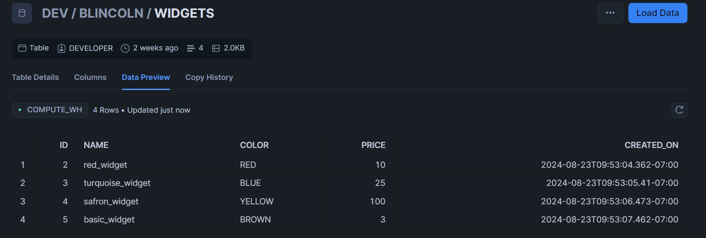

WIDGET_ACCESS_RULES

```
create or replace TABLE DEV.BLINCOLN.WIDGET_ACCESS_RULES (
WIDGET_ID NUMBER(38,0),
ACCOUNT_NAME VARCHAR(16777216)
);
```
These rows are present in the WIDGET_ACCESS_RULES table and maintained
there:

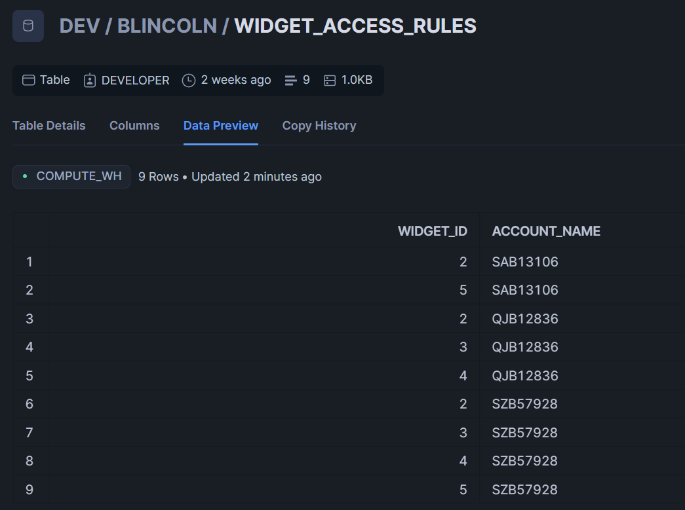

There are three unique ACCOUNT_NAME values: SAB13106, QJB12836, and
SZB57928. These represent the account locator values for an account,
or, exactly  
what the function CURRENT_ACCOUNT() returns when logged in
under a given account. SZB57928 is the account locator for Resource
Data's main internal  
Snowflake account. QJB12836 is the locator for a
reader account that is associated with Resource Data's main account.
SAB13106 represents a trial account  
that I just signed up for and has
28 days left of time on it.

WIDGETS_VIEW
```
create or replace secure view DEV.SHARE_SCHEMA.WIDGETS_VIEW(
ID,
NAME,
COLOR,
PRICE,
CREATED_ON
) as
SELECT w.*
FROM DEV.BLINCOLN.widgets AS w
WHERE w.id IN (SELECT widget_id
FROM DEV.BLINCOLN.widget_access_rules AS a
WHERE upper(account_name) = CURRENT_ACCOUNT());
```
This secure view makes use of WIDGETS and WIDGETS_ACCESS_RULES and
returns rows based on the return value of the function
CURRENT_ACCOUNT(). There is  
currently a version of it in
DEV.SHARE_SCHEMA, but the important thing is the secure view query
itself.

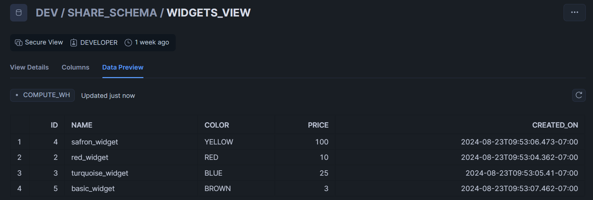

Note that for the screenshot of WIDGETS_VIEW, I was logged into the
main Resource Data Snowflake account, which has a locator of SZB57928.  
Consequently, I get four rows, which represents the idea that in this
example, my account has access to all four types of widgets. For the
reader account,  
it is simple to provide a share to this view so that
from that account, you see three rows. But for this document, I will
go over the other method of sharing  
this view, via a Snowflake Native
App and Private Listing.

# Tool -- Install Snowflake CLI

[Official Instructions for Snowflake CLI Installation](https://docs.snowflake.com/en/developer-guide/snowflake-cli-v2/installation/installation)

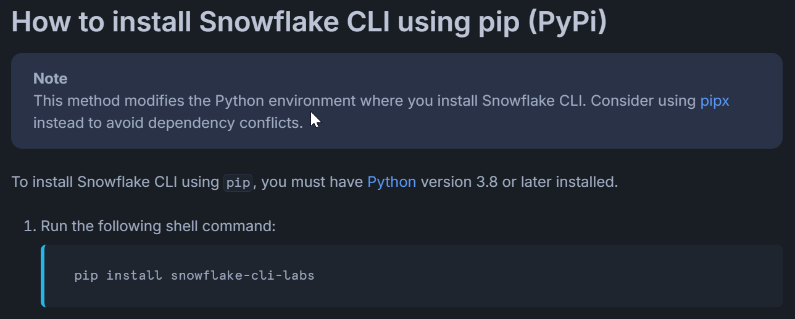

Snowflake CLI is installed by installing the python library
snowflake-cli-labs. If you use [anaconda](https://www.anaconda.com/),
you can use the file local_test_env.yml in this folder and this command:

```
conda env update -f local_test_env.yml
```
It installs a conda environment called snowflake-cli that includes
pytest, streamlit, and a few other relevant libraries besides Snowflake  
CLI. Then to activate that conda environment, use the following command:

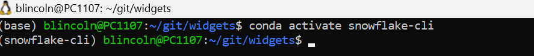

Then the main command you'll be interested in is snow:

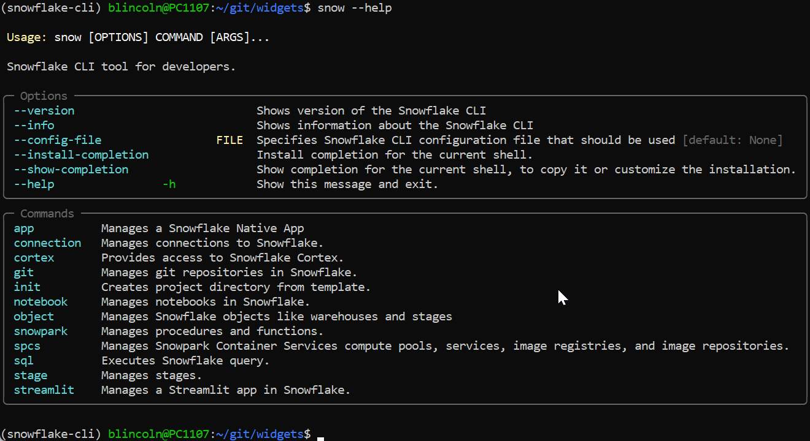

Configure the connection to Snowflake

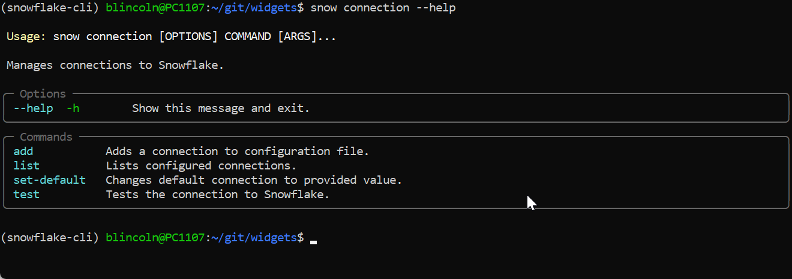

Ordinarily, you'll want to use the following command to add a
connection:

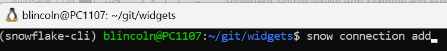

This will simply ask for individual fields iteratively and then edit a
local file called config.toml. Note that I run everything from a Windows  
Subsystem for Linux Ubuntu installation on my windows machine, so for me
this file is located in the .config folder relative to my home Linux
folder:

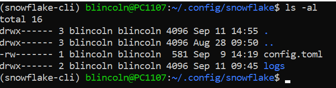

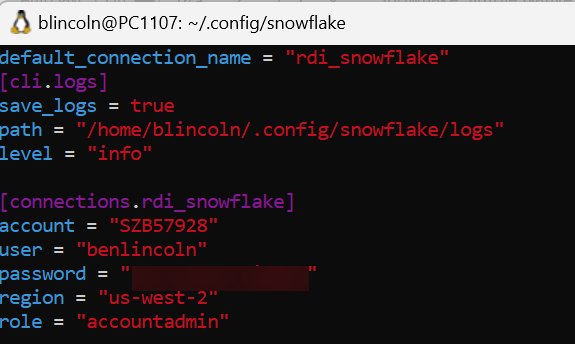

I have also named my connection rdi_snowflake and made that the default
connection. You will need at least the above fields specified. Note that  
my password is blurred in this document.

# Create Native App relevant files locally

Note:  This section mentions the steps to create the files, but for the markdown version of this document, the files should be in the repository

Run the following command to create a folder with skeleton Native App files present:
```
Snow app init widgets
```

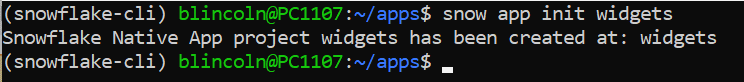

Once you've done this, the folder structure should look like this:

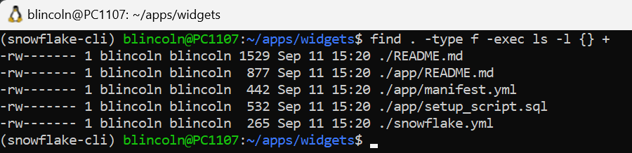

Create a folder called scripts and create a file in it called shared_content.sql and copy the following contents into the file:
```
ALTER APPLICATION PACKAGE {{package_name}} SET DISTRIBUTION = EXTERNAL;

USE APPLICATION PACKAGE {{package_name}};

CREATE SCHEMA shared_data;
USE SCHEMA shared_data;

create or replace secure view widgets(
ID,
NAME,
COLOR,
PRICE,
CREATED_ON
) as
SELECT w.*
FROM dev.blincoln.widgets AS w
WHERE w.id IN (
SELECT widget_id
FROM dev.blincoln.widget_access_rules AS a
WHERE upper(account_name) = CURRENT_ACCOUNT()
);

GRANT REFERENCE_USAGE ON DATABASE dev TO SHARE IN APPLICATION PACKAGE
{{package_name}};

GRANT USAGE ON SCHEMA shared_data TO SHARE IN APPLICATION PACKAGE
{{package_name}};

GRANT SELECT ON VIEW widgets TO SHARE IN APPLICATION PACKAGE
{{package_name}};
```
Edit snowflake.yml and paste the following text into it, overwriting what is there:
```
definition_version: 1
native_app:
  name: widgets_app
  source_stage: stage_content.widgets_app_stage
  artifacts:
    - src: app/*
      dest: ./
    - streamlit/widgets_app.py
  package:
    name: widgets_app_package
    scripts:
      - scripts/shared_content.sql
  application:
    name: widgets_app
    debug: false
```
Edit app/setup_script.sql and paste the following text into it, overwriting what is there:

```
CREATE APPLICATION ROLE IF NOT EXISTS app_public;

CREATE SCHEMA IF NOT EXISTS core;

GRANT USAGE ON SCHEMA core TO APPLICATION ROLE app_public;

create or replace secure view core.widgets(
ID,
NAME,
COLOR,
PRICE,
CREATED_ON
) as
SELECT *
FROM shared_data.widgets;

GRANT SELECT on view core.widgets to APPLICATION ROLE app_public;

CREATE OR ALTER VERSIONED SCHEMA code_schema;

GRANT USAGE ON SCHEMA code_schema TO APPLICATION ROLE app_public;

CREATE OR REPLACE STREAMLIT code_schema.widgets_app
FROM '/streamlit'
MAIN_FILE = '/widgets_app.py'
;

GRANT USAGE ON STREAMLIT code_schema.widgets_app TO APPLICATION ROLE
app_public;
```

Create a folder called streamlit and create a file inside called widgets_app.py with the following contents:
```
 # Import python packages
 import streamlit as st
 from snowflake.snowpark.context import get_active_session

 # Get the current credentials
 session = get_active_session()
 cmd = f"""
 select * from core.widgets
 """

 queried_data = session.sql(cmd).to_pandas()
 st.subheader(\"WIDGETS\")
 st.dataframe(queried_data, use_container_width=True)
```
Now the folder structure should look like this:

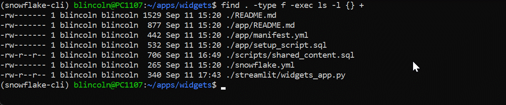

# Run the App against RDI Snowflake

Run this command to create a version of the app before running it:
```
snow app version create v1_0 -c rdi_snowflake
```
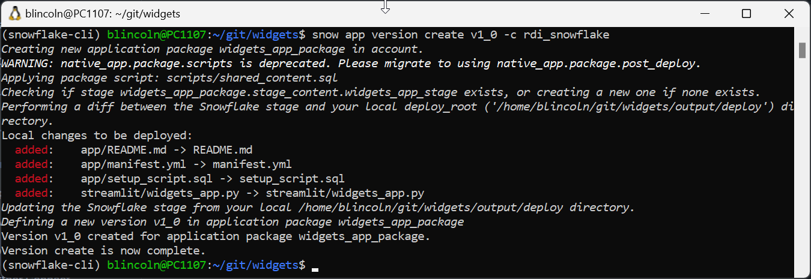

Now run this command to run the app and load it into snowflake:
```
snow app run --version V1_0 -c rdi_snowflake 
```
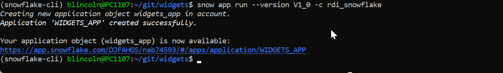

Now run this command to set the release directive, a required step to list a data app, which we will do shortly:
```
snow sql -q "ALTER APPLICATION PACKAGE widgets_app_package SET DEFAULT RELEASE DIRECTIVE VERSION = v1_0 PATCH = 0" -c rdi_snowflake
```

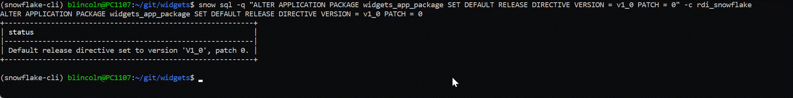

At this point, the account should have all it needs in snowflake and we 
should be able to check. From RDI's Snowflake with accountadmin rights,  
go to Data Products at the left hand margin and click on Apps

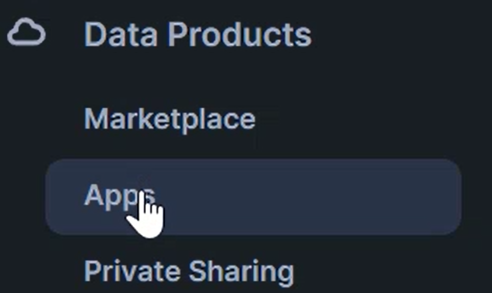

Find WIDGETS_APP and click on it:

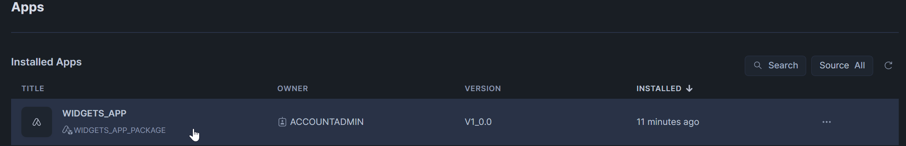

From there, click on the rightmost WIDGETS_APP link

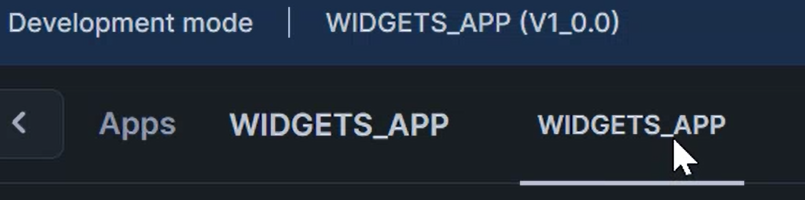

You should see this, indicating that you are seeing correct results for
the RDI Snowflake Account:

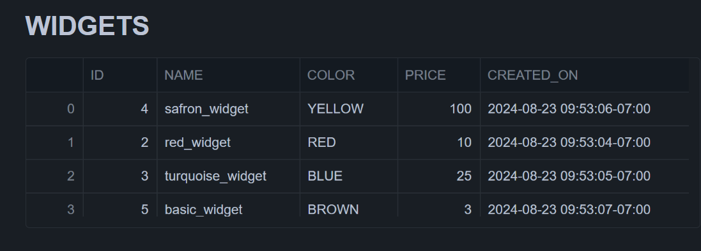

# List the App Privately

From RDI Snowflake Account in Snowsight, run the following command:
```
SHOW VERSIONS IN APPLICATION PACKAGE widgets_app_package;
```
The results of this query should be as follows, and most importantly,
the review_status field should show 'APPROVED':

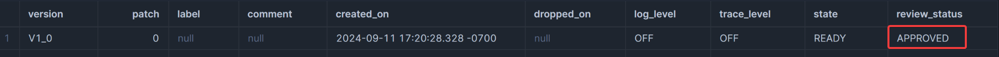

If it does not show 'APPROVED,' then I think the most likely issue is
just waiting until the automated scan has finished, which gets
initiated  
when the release directive is set (see step 3 of running the
app above). It's also possible that the line at the top of
scripts/shared_content.sql  
has not been run and needs to be, where
{{package_name}} would at this stage be replaced with the name of the
package, WIDGETS_APP_PACKAGE:
```
ALTER APPLICATION PACKAGE WIDGETS_APP_PACKAGE SET DISTRIBUTION =
EXTERNAL;
```
If those two things have happened and it is still not approved, you
and/or someone else will have to figure out why. REVIEW_STATUS needs
to be  
'APPROVED' to move on to the next step.  
Click on Provider Studio under Data Products on the left hand margin
    of Snowsight while logged into RDI Snowflake with ACCOUNTADMIN
    privileges:

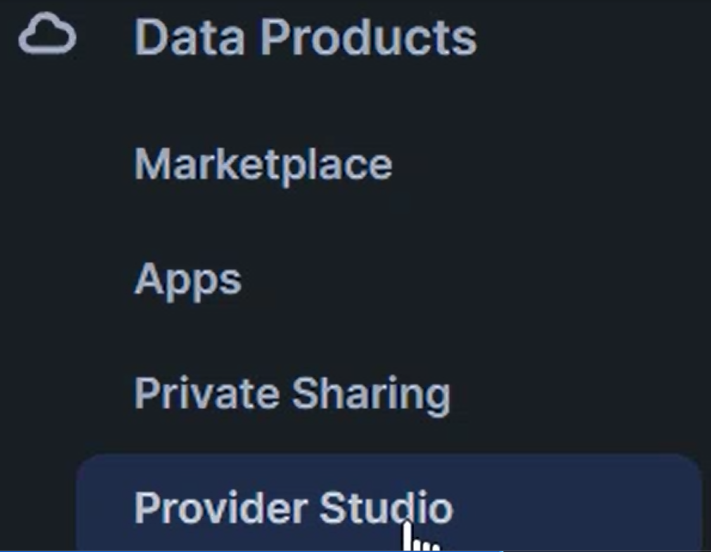

Click on "Create a listing"

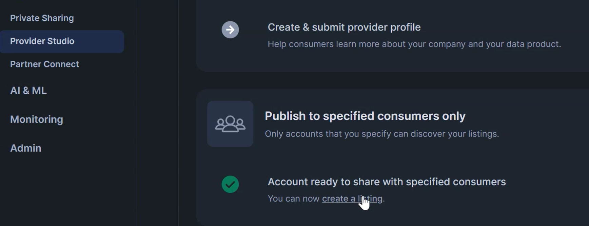

In the Create Listing dialog, make sure "Only Specified Customers" is 
selected and type "WIDGETS_APP_PACKAGE" into the text box under the  
prompt, "What's the title of the listing?". Click Next.

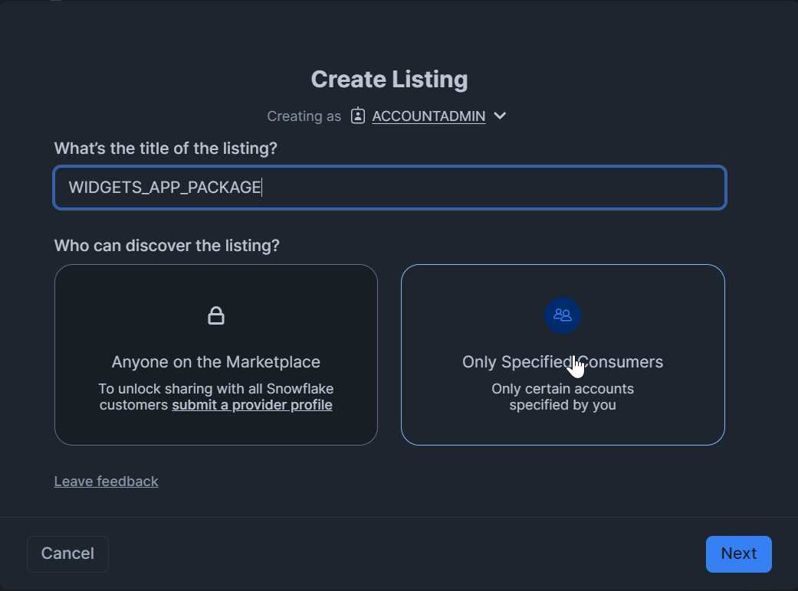

In the next "Create Listing" dialog, click +SELECT and click on 
WIDGETS_APP_PACKAGE to select it. Type "WIDGETS_APP_PACKAGE" or 
whatever  
you want in the text box marked "Briefly describe your 
listing." Lastly, you need the locator code for the snowflake 
account of your customer.  
For me this was a trial account, and from 
that account, I retrieved the locator code by clicking below:

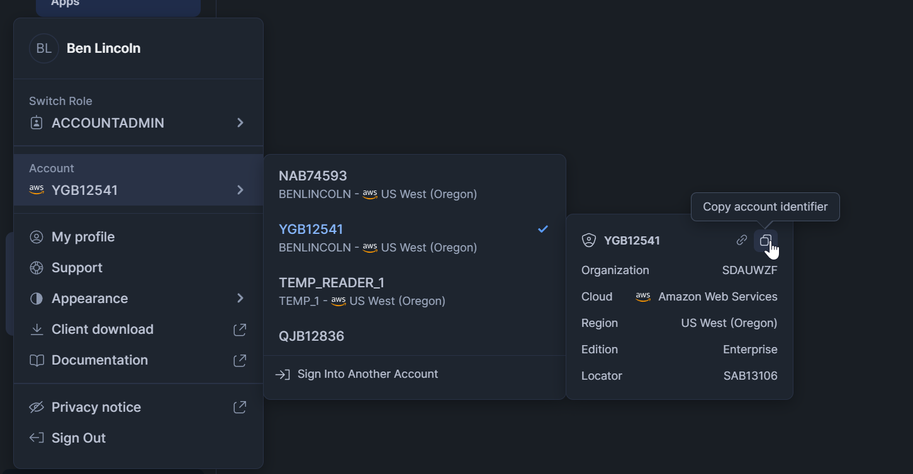

Paste that into the box that says, "Use account identifier to add." If
all goes well, it will search for that account and you can click it to
confirm. Then click Publish.

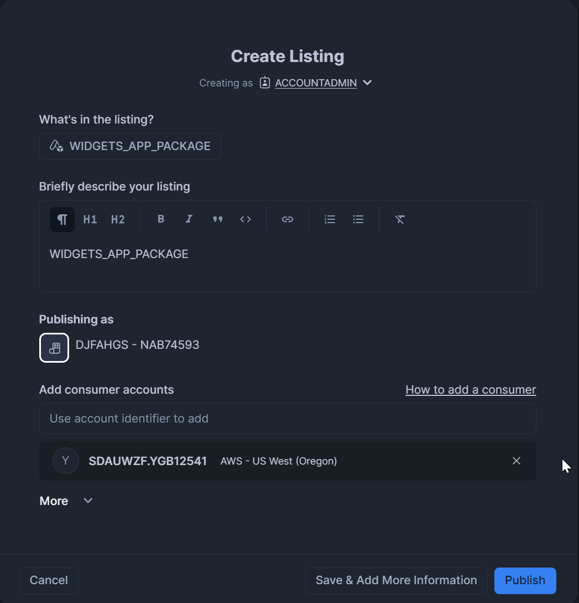

Now from the customer's Snowflake Apps menu (for me my trial 
account), you should see that the app was shared with them:

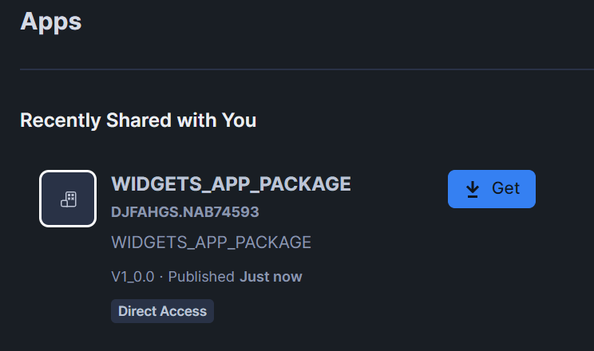

If they click Get, then Listing Details, and then Open, they should
be able to reach the same Streamlit WIDGETS_APP page, and it should
look like this:

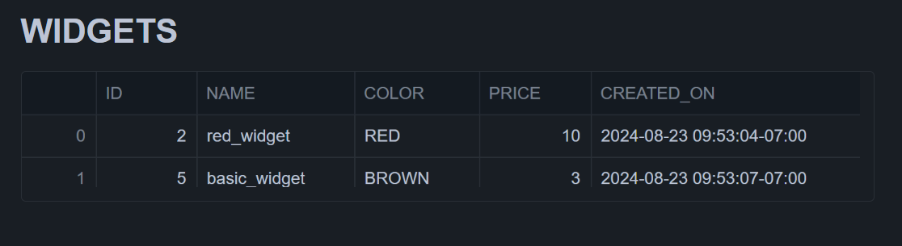

This is a different subset of widgets showing that the share is relevant
to them because their account is different and we are as a result
retrieving different results.

