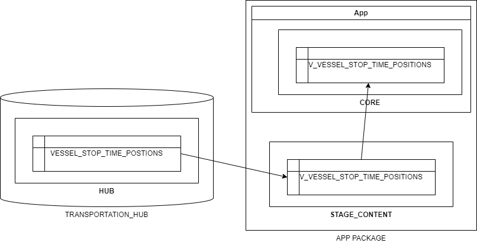

# Read Me
This folder contains a sample Snowflake app demostrating how to incorporate Streamlit, Python, and the SnowPark API to create a Data App using Snowflake's Native App Framework.
It illustrates three different ways to leverage these technologies to create data apps:

1. Local development environment
2. Streamlit App
3. Native App Framework

## Local Development Environment
To setup a local development environment using VS code to run this sample:

1. Create a Python Environment (Windows)
- install [miniconda](https://docs.conda.io/projects/miniconda/en/latest/index.html) for Python 3.9 
- In the terminal, from the root of this folder, create a conda environment:
    ```
    conda create --name otp-sample-app -c https://repo.anaconda.com/pkgs/snowflake python=3.9
    ```
- Activate the environment
    ```
    conda activate otp-sample-app
    ```
- install snowpark api and streamlit
    ```
    conda install -c https://repo.anaconda.com/pkgs/snowflake/ snowflake-snowpark-python
    conda install pip
    pip install streamlit
    ```

2. Set up environment configuration
- edit .\src\streamlit\secrets.toml with snowflake connection details

3. Run it
- From the terminal, in the root of this folder, run the following to verify correct snowflake configuration:
```
streamlit run validate_credentials.py
```
- Run the app:
```
streamlit run OPTSampleApp.py
```
- Ctrl-C in Terminal to terminate

## Streamlit App
To deploy this example in the local snowflake account using Snowsight:
- Connect to Snowflake in Snowsight with a role that has rights to the TRANSPORTATION_HUB database
- Click on "Streamlit" in left navigation pane
- Click "+ Streamlit App" to create a new streamlit app
    - Give the app a unique name
    - Choose COMPUTE_WH for warehouse
    - Choose TRANSPORTATION_HUB.HUB for database and schema
- Replace the Example Streamlit App code displayed in the worksheet with the contents of OTPSampleApp.py

This illustrates the ability to display a 'local' streamlit app in an account that can have direct access to database objects within the account.

## Native App Framework
To package the solution as a Native App that could be shared between snowflake accounts, follow the recipe outlined in Deploy.sql.
Be sure to include OTPSampleAppPackaged.py in the application package (and NOT OTPSampleApp.py)
Note that one of the benefits of the Native App Framwork is that data products can be shared across accounts to any account 
on the Snowflake platform that provide access to data without having to physically move the supporting data. To support this, however, 
a three-step process is required to share the data from a database within an account to the application:

1. Grant access to the source data in the account database to an Application Package
2. Create a view within the Application Package to reference the shared data
3. Create another view within the App inside the Application package to reference the application package view



