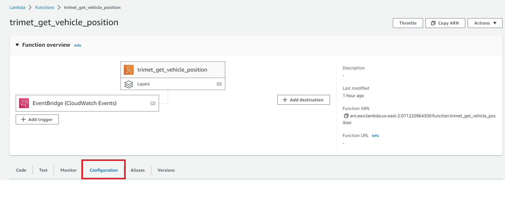
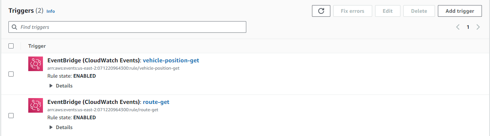
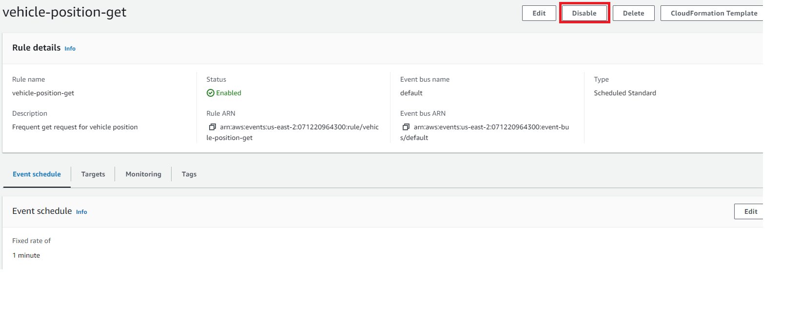

# Data Sources and Requirements
The Transportation Hub utilizes TriMet General Transit Feed Specification data offered via REST API and accessed using HTTPS GET requests. Documentation for the API can be found in [a_TriMet GTFS](<a_TriMet GTFS.md>) or [online](https://developer.trimet.org/ws_docs/).

# Extraction Tools
RDI's "Portland_Office" AWS account hosts the processes required for data extraction and raw data storage. A Lambda function executes a Python GET request on the TriMet REST API to access its endpoints. Two Amazon EventBridges trigger the Lambda function to get TriMet route data and vehicle position data, scheduled at a one month and one minute frequency, respectively.

## Lambda Function
The Lambda function is written in Python to execute a HTTP GET request using the urllib3 library and connects to the S3 bucket using the boto3 library. The script consists on three functions: `_get_key`, `get_endpoint`, and `lambda_handler`. Source code can be found in [trimet_get_vehicle_position.py](<../AWS Lambda/trimet_get_vehicle_position.py>).

### `_get_key`
`_get_key` generates a unique filename for the json object obtained from the endpoint by combining the specific service of the data (e.g. vehicles) and a timestamp for when the GET request was executed. 

### `get_endpoint`
`get_endpoint` constructs the endpoint url based on the EventBridge payload determining which endpoint to execute the GET request on. It then executes the GET request on that endpoint, traverses through the json object to get the desired data set, and returns that object and the GET request status code.

### `lambda_handler`
`lambda_handler` executes the above functions and puts the returned json object into the defined S3 bucket.

## EventBridge
We utilize two EventBridges to specify which endpoint to execute a GET request for and at what interval we execute them. The EventBridges trigger the Lambda function and provide a constant to the function's arguements.

To start and stop the EventBridges associated with the `trimet_get_vehicle_position` Lambda function, navigate to the Lambda function and select the "Configuration" tab.


Scroll down to the "Triggers" associated with the Lambda function and review the "Rule state" for each trigger.



If you'd like to change the state of the trigger, navigate to that trigger's settings and select Enable/Disable.


### `route-get`
`route-get` executes on a monthly basis and provides the following input constant to specify the endpoint for TriMet routes:
```
{
  "api_version": "v1/",
  "service": "routeconfig",
  "payload_key": "route"
}
```

### `vehicle-position-get`
`vehicle-position-get` executes on a minute basis and provides the following input constant to specify the endpoint for TriMet vehicle positions:
```
{
  "api_version": "v2/",
  "service": "vehicles",
  "payload_key": "vehicle"
}
```