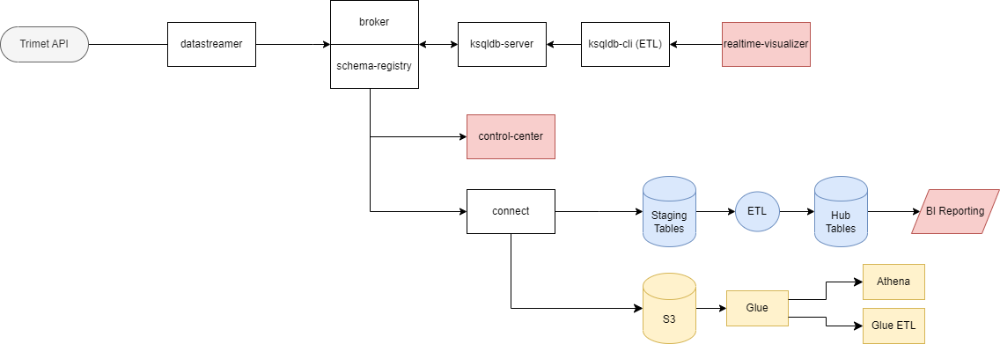

# Transportation Hub
The Transportation Hub is RDI's internal data warehousing project to test new tools and functionalities in those tools, such as Snowflake and Dynamic tables, and to provide a space for training internal staff.

The Transportation Hub warehouses data for Portland's local transit system, TriMet. It currently utilizes AWS for ingesting and storing the raw data and Snowflake for warehousing.

The architecture of the pipeline is as follows:


The main requirement for running the realtime pipeline is [docker desktop](https://www.docker.com/products/docker-desktop/) with [WSL](https://learn.microsoft.com/en-us/windows/wsl/install) to run it from linux assuming a windows workstation. 
 
The realtime component of the pipeline is launched from a linux shell prompt as follows:
```
cd RealtimeStreaming
./sh/run.sh
```
