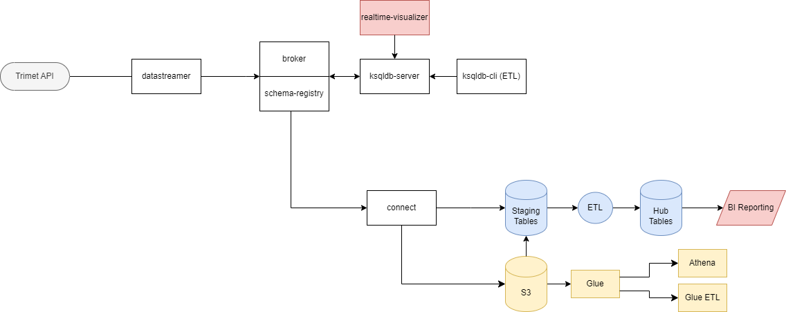
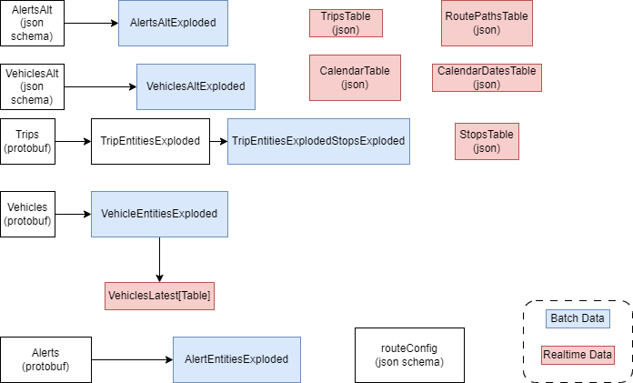

# Transportation Hub

The Transportation Hub is RDI's internal data streaming and data warehousing project to test new tools and functionalities in those tools.  Several technologies are used here including:

* Docker Compose - bringing up multiple containers on the same local network
* WSL - linux on Windows
* Shell Scripts - running commands on containers
* Python - small text file dataframe operations
* Java - data requests on trimet API and data writes to kafka broker 
* Confluent
  * Kafka Broker - durable queues and stream processing
  * Schema Registry - track schema's for data inputs, also used for serializing and deserializing binary data 
  * Control Center - viewing all streaming operations 
  * Ksqldb - streaming ETL
  * Connect - configuring output data destinations
* React - javascript web development framework
* React Leaflet - react components for leaflet maps
* Snowflake - data warehouse operations
* DBT - framework for writing ETL operations in Snowflake
* AWS 
  * S3 - storing data on the cloud
  * Glue - data catalogs and ETL jobs
  * Athena - moderate sized queries

# Table of Contents
1. [Running](#topic-1)
2. [Overview](#overview)
3. Components
   1. [Trimet API](#trimet-api)
   2. [datastreamer](#datastreamer)
   3. [broker/schema-registry](#broker-schema-registry)
   4. [realtime-visualizer](#realtime-visualizer)
   5. [ksqldb-server](#ksqldb-server)
   6. [ksqldb-cli](#ksqldb-cli)
   7. [control-center](#control-center)
   8. [connect](#connect)
   9. [snowflake](#snowflake)
   10. [aws](#aws)

## Running

1. An appid is required from trimet.  [Register](https://developer.trimet.org/appid/registration/) your contact information to get one.  They will send the appid in an email.
2. Enter the appid obtained in `src/main/resources/producer.properties`.
3. An ssh key must be generated for communicating with snowflake. For directions on setting this up, consult the snowflake [reference](https://docs.snowflake.com/en/user-guide/key-pair-auth).  Note, the `ALTER USER` step must be performed by someone with `ACCOUNTADMIN` credentials.  The ssh key will factor into correct settings for the various snowflake connect configurations (SnowflakeSinkConfig.json, SnowflakeSingleSinkConfig.json).  Additionally, to configure the S3 connector for kafka (S3SinkConfig.json), aws access credentials, namely `AWS_ACCESS_KEY_ID` and `AWS_SECRET_ACCESS_KEY` must be obtained. 
4. The main requirement for running the realtime pipeline is [docker desktop](https://www.docker.com/products/docker-desktop/) with [WSL](https://learn.microsoft.com/en-us/windows/wsl/install) to run it from linux assuming a windows workstation. 
 
The realtime component of the pipeline is launched from a linux shell prompt as follows:
```
cd RealtimeStreaming
source sh/run.sh
do_all
```
If you want to run select sections of the startup sequence, look in `sh/run.sh`.
This shell script will do the following:

1. Deploy all containers using docker according to the `docker-compose.yml` file.
2. Add static data sets.
3. Setup kafka topics.
4. Initialize feeds to broker and schema registry.
5. Deploy ksql ETL transformations in lexicographic order of file name.
6. Deploy the Snowflake kafka connect sink for continuous feeds.
7. Deploy the Snowflake kafka connect sink for one time feeds.
8. Deploy the S3 kafka connect sink.

The containers can be stopped and associated data deleted with
```
./sh/stop.sh
```

## Overview

This project demonstrates the [lambda architecture](https://en.wikipedia.org/Lambda_architecture).  Data is fed into a message queue, and consumed by a speed layer and batch processing layer simultaneously.  Because messages are sent in batches to the batch processing layer, higher latency is introduced.  However, the batch processing layer will contain much higher volumes of data, and can process queries that run over a longer history.  In contrast, the speed layer will process messages immediately, and make messages available to queries with much less latency.  The speed layer does not normally retain a large volume of messages.  


In our project the:
* message queue is a Kafka broker
* speed layer processing is performed by the ksqldb sql flow backed by kafka topics
* batch processing is performed by Snowflake and alternately on AWS by S3, Glue, and Athena

The configurations in the kafka connector determine the basis upon which messages are buffered to the batch processing layer.  The architecture of the pipeline is as follows, descriptions for all components pictured follow:


The various locally deployed docker containers are depicted as squares.  The components that are deployed on Snowflake are shown in blue.  Containers that have visual components that can be accessed in the browser are shown in red.  The yellow elements are in AWS.  Most references to files are with respect to the `RealtimeStreaming` directory.

### Trimet API

The Transportation Hub warehouses data for Portland's local transit system, TriMet.  The starting point for data is the [GTFS api](https://developer.trimet.org/GTFS.shtml).  [json](https://developer.trimet.org/ws_docs/) and [protobuf](https://www.transit.land/feeds/f-trimet~rt/) are streamed and buffered in this project. 

#### json, json schema, protobuf, parquet

The various data formats used in this project each have their advantages and use cases, and it is worth pointing them out.  When we refer to schema changes, we mean, addition or removal of fields and changes of field data types. We will show samples of each just to get a sense of what each format entails.

* json - the simplest one because it is human readable, can be confounding for a consumer of data.  First, json is usually large and takes longer to transmit as a result.  Secondly, schema changes are difficult to adapt to.  When the data is consumed the assumption is that the schema will not change.  Inevitably, this assumption does not hold true and problems follow.  The only solution for the consumer is to maintain their own manually constructed schema, and take action when non-conforming messages with new schema come in.  Thus schema adaptation is data driven.  A third problem is that traversal of schema is slow because string parsing must occur in order to find data.  The need for human readable json is merely a choice of which machine translation layer will be used to view data.

```json
{
  "f1": 2,
  "f2": [3,2,5],
  "pairs": {
    "key": "hello",
    "value": "world"
  }
  "description": "this is a JSON file"
}
```

* json schema - if the producer can provide a schema, at least the adaptation to new schema is producer driven.  Nonetheless, the other two problems of json, lack of compression and slow traversal persist.  The schema itself does tend to be on the more verbose side and harder to understand.  This is why we serialized with Jackson as opposed to writing json schema.

```json
{
  "$id": "https://example.com/test.json",
  "$schema": "https://json-schema.org/draft/2020-12/schema",
  "title": "Test",
  "type": "object",
  "required": [
    "f1"
  ],
  "properties": {
    "f1": {
      "type": "number"
    },
    "f2": {
      "type": "array",
      "items": {
        "type": "number"
      }
    },
    "pairs": {
      "type": "object",
      "required": [
        "key",
        "value"
      ],
      "properties": {
        "key": {
          "type": "string"
        },
        "value": {
          "type": "string"
        }
      }
    },
    "description": {
      "type": "string"
    }
  }
}
```

* protobuf - is a great format for single records.  It is compressed, all messages must conform to a schema and thus schema evolution is straightforward, and because it is in a binary format, it is relatively easy to traverse the data.  It's only downside is that it is not human-readable.  This is usually not a problem because Protobuf is almost always an intermediate data format not used for reading data.

```c++
message Test {
    required int32 f1 = 1;
    repeated int32 f2 = 2;
    repeated Pair pairs = 3;
    optional string description = 4;
}

message Pair {
    required string key = 1;
    required string value = 2;
}
```

* parquet - is a column oriented format that is fantastic as an end data format, as large aggregate queries are faster, due to physically close columnar data orientation and projection.  Converting between multiple schematized messages and parquet is relatively straightforward since each has a schema and translations between schema are straightforward.  We use parquet in this project exclusively in S3.

```c++
message schema {
  required int32 f1;
  optional group f2 (LIST) {
    repeated group list {
      optional int32 element;
    }
  }
  optional group pairs {
    required binary key (STRING);
    required binary value (STRING);
  }
  optional binary description (STRING);
}
```

### datastreamer

All the custom code written is in the `com.resourcedata.transportationhub.realtime` package.  The `com.google.transit.realtime` package contains POJO's that are used to send Json with JsonSchema.  An example is shown below:

```java
import com.fasterxml.jackson.annotation.JsonAutoDetect;

import java.math.BigInteger;
import java.util.List;


@JsonAutoDetect(fieldVisibility=JsonAutoDetect.Visibility.ANY)
public class ResultSetAlert {
    @JsonAutoDetect(fieldVisibility=JsonAutoDetect.Visibility.ANY)
    static class AlertSet {
        @JsonAutoDetect(fieldVisibility=JsonAutoDetect.Visibility.ANY)
        static class Alert {
            @JsonAutoDetect(fieldVisibility=JsonAutoDetect.Visibility.ANY)
            static class Location {
                Double lng;
                Boolean no_service_flag;
                String passengerCode;
                BigInteger id;
                String dir;
                Double lat;
                String desc;
            }
            @JsonAutoDetect(fieldVisibility=JsonAutoDetect.Visibility.ANY)
            static class Route {
                String routeColor;
                Boolean frequentService;
                Integer route;
                Boolean no_service_flag;
                String routeSubType;
                Integer id;
                String type;
                String desc;
                BigInteger routeSortOrder;
            }

            List<Route> route;
            String info_link_url;
            BigInteger end;
            Boolean system_wide_flag;
            List<Location> location;
            BigInteger id;
            String header_text;
            BigInteger begin;
            String desc;
        }
        List<Alert> alert;
        BigInteger queryTime;
    }
    AlertSet resultSet;
}
```

Generated sources are produced from protobuf using the respective maven plugin.  The section of `pom.xml` that makes this happen is show below 

```xml
            <plugin>
                <groupId>com.github.os72</groupId>
                <artifactId>protoc-jar-maven-plugin</artifactId>
                <version>3.11.4</version>
                <executions>
                    <execution>
                        <phase>generate-sources</phase>
                        <goals>
                            <goal>run</goal>
                        </goals>
                        <configuration>
                            <protocVersion>3.24.3</protocVersion>
                            <inputDirectories>
                                <include>src/main/resources</include>
                            </inputDirectories>
                            <outputDirectory>target/generated-sources</outputDirectory>
                        </configuration>
                    </execution>
                </executions>
            </plugin>
```

The custom java application was written to consume data from the selected trimet api feed and push to kafka. The application is driven by command line arguments.

The java code first gets a json or protobuf data object using a supplied `appID` request parameter in its http request.  The returned payload is returned as an array of bytes. If the user requests to write the payload to a file, it will be written.  Thereafter, the message is deserialized as a `FeedMessage` type object in the protobuf case defined in the gtfs protobuf [specification](https://developers.google.com/transit/gtfs-realtime/reference).  In the json case, the message is deserialized using the various classes defined in `com.google.transit.realtime`.  In either case, the use of the Java Stream package makes the logic more functional.  In addition, the use of generics unifies the final steps of stream processing as show below:

```java
    public static <T> void streamData(Stream<T> stream, Properties properties, CliArgs cliArgs){
        try(Producer<String, T> producer = new KafkaProducer<>(properties)){
            final DataStreamer<T> dataStreamer = new DataStreamer<>(producer, cliArgs);
            stream.forEach(dataStreamer::produce);
        }
    }
```

Once the protobuf payload has been deserialized, it is then pushed by the `Producer` to kafka.  Note the configuration parameters `BOOTSTRAP_SERVERS_CONFIG` and `schema.registry.url` in `producer.properties`.  These are the locations of the broker and schema registry.  The port for the broker is set to the listener port `29092` which is different than the host network port `9092`.  If `9092` is used, communication with the broker will not occur.  
The preset command given in the `dockerfile_datastreamer` ensures that the container stays open indefinitely.  Normally containers terminate if there is not an active command in process.
```
command: ["tail", "-f", "/dev/null"]
```
The datastreamer is written as a maven package and is made to deploy into an Ubuntu java docker container that contains both java runtimes and the sdk.  For more information, consult the `dockerfile_datastreamer` file.

### broker/schema-registry

The broker is the data storage layer of kafka.  Each separate data stream is stored in a durable queue. Each separate data queue is organized by topic.  The datastreamer container from above is a producer of data to kafka.  In our usage of kafka, we will only be using one partition per topic.  More partitions can be used in the distributed case for faster throughput.  A schematic of how a broker works with a topic on one partition is shown below:

 

The messages from the topic are maintained in a queue regardless of the consumer's activity (unlike a queue service such as SQS).  Based on whichever occurs first of retention time exceeded or size exceeded, the oldest messages are deleted (in a LIFO manner). Consumers of topics, per session can decide from which point they want to read the queue; earliest, latest, or at a defined offset.

When using structured data such as json schema, protobuf, or avro, a schema registry is necessary to assist with serializing/deserializing data as well as evolving schema. The schema registry and broker work together to handle all read and write requests.  


### realtime-visualizer

The realtime-visualizer provides a user interface for displaying realtime data. The realtime-visualizer consists of a React.js application that makes requests to the ksqldb-server, and plots returned information in a Leaflet.js map.  The `ksqldb-server` and ultimately the kafka broker backing it provides data to the realtime visaulizer. In a locally deployed version, it can be seen on `https://localhost:8090`.

### ksqldb-server

ksql is kafka's most accessible, realtime ETL language. The ksqldb-server handles all ETL requests. The current flow of streaming transformations is shown below: 



One of the ksql queries used in the pipeline is shown below as an example.  We are joining the stream `VehicleEntitiesExploded` against the table `StopsTable`.  It should be noted that this query generates a stream.  A stream is an append only unbounded sequence of data.  The kafka topic `VehicleStopConnectorExp` backs this stream as a persistence layer.  It should be noted that here we are also creating an additional key to be used for a join upstream.  ksql only supports joins against single keys, so this is our way of supporting multi key joins. 

```sql
CREATE STREAM VehicleStopConnectorExp
    WITH (KAFKA_TOPIC='VehicleStopConnectorExp', VALUE_FORMAT='PROTOBUF')
    AS
    SELECT
        s.stop_id as stop_id,
        concat(v.entity->vehicle->trip->trip_id,'_',cast(s.stop_sequence as string)) as trip_seq_id,
        s.stop_lat as stop_lat,
        s.stop_lon as stop_lon,
        s.stop_name as stop_name
    FROM VehicleEntitiesExploded v
    JOIN StopsTable s ON s.stop_id = v.entity->vehicle->stop_id
EMIT CHANGES;
```

In contrast, a table is a key value store that contains the latest state for any given key.  In our example below, a vehicle id `entity->id` is the key, and for every vehicle, we are showing the latest state of various properties of the vehicle in this table.  The query `SELECT * FROM VEHICLESLATEST` will then show this latest state.  In fact this [exact query](./RealtimeStreaming/client-app/src/api/VehiclesApi.js#L13) can be seen in the visualizer app.

```sql
CREATE TABLE VehiclesLatest
  WITH (KAFKA_TOPIC='VehiclesLatest', VALUE_FORMAT='PROTOBUF')
    AS SELECT
                entity->id as vehicle_id,
                LATEST_BY_OFFSET(entity->vehicle->position->latitude) as latitude,
                LATEST_BY_OFFSET(entity->vehicle->position->longitude) as longitude,
                LATEST_BY_OFFSET(entity->vehicle->current_status) as current_status,
                LATEST_BY_OFFSET(entity->vehicle->current_stop_sequence) as current_stop_sequence,
                LATEST_BY_OFFSET(entity->vehicle->stop_id) as stop_id,
                LATEST_BY_OFFSET(entity->vehicle->trip->route_id) as route_id,
                LATEST_BY_OFFSET(entity->vehicle->timestamp) as timestmp,
                LATEST_BY_OFFSET(entity->vehicle->position->bearing) as bearing,
                LATEST_BY_OFFSET(entity->vehicle->position->speed) as speed
        FROM VehicleEntitiesExploded
        GROUP BY entity->id
EMIT CHANGES;
```
An in-depth discussion showing the difference between streams and tables is given by [confluent](https://www.confluent.io/blog/kafka-streams-tables-part-1-event-streaming/).
### ksqldb-cli
The ksqldb-cli provides a cli for issuing ksql requests. 

### control-center
The control center provides a user interface for viewing everything happening in the kafka containers as well a way to supply ad-hoc configuration and ETL requests.  The control center can be accessed on a local container deployment at `https://localhost:9021`.


### connect
The kafka connect plugin is a suite of tools for connecting outside data sources as sinks and sources, places for sending and getting data respectively.  In our case, we are sending the data to snowflake and S3.  The only customization we make to the regular kafka connect container is to install the snowflake connector by copying the jar file for snowflake connect app along with bouncycastle, which is needed for decrypting ssh passphrases.  The snowflake sink connector is configured using `SnowflakeSinkConfig.json`.  Current connector configurations can be accessed from the control center under the connect section.

### snowflake
Select topics, specified in the "topics" field of the `SnowflakeSinkConfig.json` file are sent to snowflake staging tables.  S3 data can also be used as inputs for Snowflake data.  A range of ETL jobs defined with [DBT](./DBT/README.md) than transforms that input data to a form that is appropriate for BI reporting in the hub tables.  The ETL sql code for Snowflake is defined in the `DBT` directory.

### aws

The second destination we will sending data is S3 on AWS.  We will be using S3 as a data lake.  What differentiates a data lake from a data warehouse such as snowflake is transparent use of data on S3, allowing for heterogenous data sources natively.  Data lakes, do not out of the box provide ACID transactions, but in a append only/write only scenario this is not a major downside (Further technologies such as Delta Lake and Apache Iceberg can be leveraged for these purposes).  A further advantage for a data lake is usually less cost as the management of data is less.  In our case, data is buffered into S3 using the S3SinkConnector provided by confluent.  The settings for buffering are controlled in `S3SinkConfig.json`.  In order to surface data for use in analytics and ETL jobs, the AWS Glue crawler must be run over S3 periodically to udpate the Glue Data Catalog.  Initially, the crawler will import the schema from parquet files, and infer a schema from csv files.  The crawler will add data as tables to the Glue database.  Additionally, as new partitions are added, the crawler will add those additional partitions.  Up to a moderate level of complexity, Athena is a good tool of choice for running queries over this table data.  Once materialization of transformations is desired for much more complicated usecases, a Glue ETL job can be run with code written in Spark. 
